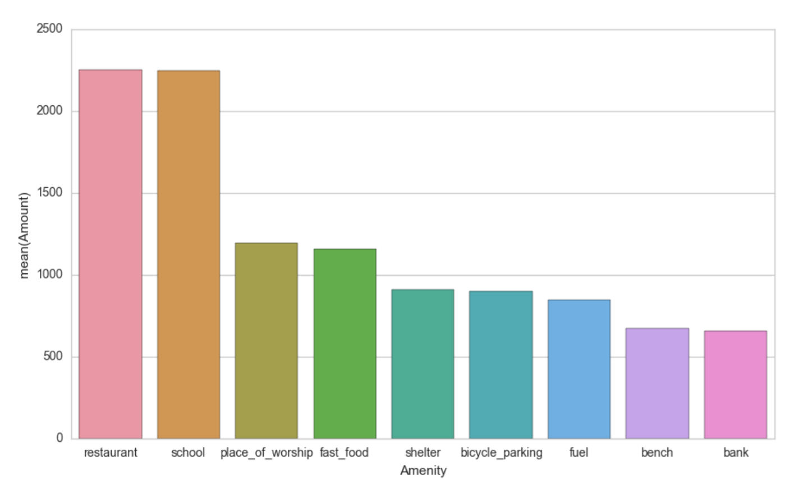
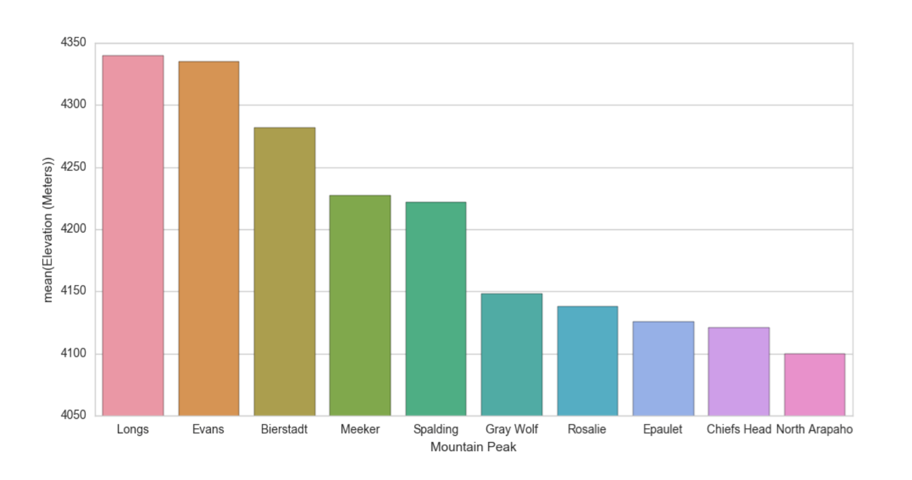

# OpenStreetMap Data Project
Data Analyst Nanodegree, P3 Data Wrangling OpenStreetMap Data, by Andrew Ehsaei

## Objective
The objective is to explore the OpenStreepMap (OSM) data on the Denver/Boulder area. I will begin by performing an audit on the data to discover errors and inconsistencies. Then I will clean up these issues and output a new version of the dataset. Next, I will create a database using the dataset and pose questions to learn about the area. I will use SQL to query the database and document my results. 

## Map Area
- Denver/Boulder, CO, United States
- [MAPZEN](https://mapzen.com/data/metro-extracts/metro/denver-boulder_colorado/)

## Problems Encountered in the Map
I downloaded the Denver/Boulder OSM data and used a python code snippet provided in the project details to take a systematic sample of elements from your original OSM region. The result was a 2MB sampled region of the original OSM dataset. I did an audit on the street address data and noticed the following issues:
- Street names are over­abbreviated *(“S Columbine St”)*
- Street names are misspelled *(“South Holly Strret”)*
- Street names gathered by TIGER system are inconsistent with other entries
- Postal codes contain the state abbreviation *("CO 80027")*
- Postal code values contain multiple postal codes *("80111:80121")
- Postal codes are incorrect *("801111")*

### Street names are overabbreviated and misspelled
I did an audit on the street names using a sample of the large dataset and noticed street name inconsistencies. One of the issues I spotted with street names was inconsistent abbreviation of the street name types ("street, road, avenue, etc"). To correct these inconsistencies I will loop through the words in the address and correct them according to a pre-defined mapping. Here is the correcting function I will use to loop through the words in an address:

```python
def fix_street_name(address, mapping):
    words = address.split()
    for w in range(len(words)):
        if words[w] in mapping:
            # Don't update 'Apartment E' to 'Apartment East'
            if words[w-1].lower() in [ 'apartment', 'apt', 'building', 'suite', 'ste.', 'ste']:
                continue
            else:
                words[w] = mapping[words[w]]
                address = " ".join(words)
    return address
```
### Street names gathered by TIGER system are inconsistent with other entries
I found that there are data entries from the Topologically Integrated Geographic Encoding and Referencing system (TIGER) that do not follow the same address format as other entries. The TIGER address data is separated into multiple tags. For example:

```python
	<tag k="tiger:name_base" v="Race" />
	<tag k="tiger:name_type" v="St" />
	<tag k="tiger:name_direction_prefix" v="S" />
```
To achieve a consistent format, I have processed the TIGER data and combined the address data into a single tag. The multiple tags are combined in the following order:

1. name_direction_prefix
2. name_base
3. name_type

### Postal codes contain the state abbreviation
I found inconsistencies with the postal code entries. Some entries followed a standard 5 digit postal code format, and some followed the full 9 digit postal code (ZIP+4) format. Also, I noticed a format that starts with the state abbreviation "CO" before the postal code and I decided to clean these up by removing the state abbreviation. An example of this is the following: "CO 80214" abd "CO80214." I first start by removing whitespace characters from the postal code, then I have a series of conditionals to format the postal code appropriately. 

Here is a code snippet of how I clean these postal codes:

``` python
    elif (len(postcode) == 7
          and postcode[:2] == "CO"
          and is_postcode_valid(postcode[2:])):

        # Correct zip code in format "CO80214"
        item['value'] = postcode[2:]

    elif (len(postcode) == 14
          and postcode[:9] == "Golden,CO"
          and is_postcode_valid(postcode[9:])):

        # Correct zip code in format "Golden, CO 80401"
        item['value'] = postcode[9:]
```

### Postal code values contain multiple postal codes
I also found entries that contained multiple postal codes in a single tag. I saw two types of formats for listing multiple postal codes. One format uses a semicolon ";" to list postal codes explicitly. The other format uses a colon ":" to indicate a range of postal codes. I handled both of these cases by breaking out the postal codes into separate tags. Here is a code snippet showing the conditionals that handle these cases:

```python
    elif (";" in postcode):

        # Add all valid postalcode values if multiples listed
        for new_postcode in postcode.split(';'):
            new_tag = item.copy()
            new_tag['value'] = new_postcode
            if(is_postcode_valid(new_postcode)):
                list_of_tags.append(new_tag)
        list_of_tags.remove(item)

    elif (":" in postcode):

        # Add all valid postalcode values if range listed
        for new_postcode in range(int(postcode.split(':')[0]), int(postcode.split(':')[1])):
            new_tag = item.copy()
            new_tag['value'] = str(new_postcode)
            if (is_postcode_valid(str(new_postcode))):
                list_of_tags.append(new_tag)
        list_of_tags.remove(item)
```

### Postal codes are incorrect
I found a few postal code entries that had an incorrect number of digits or did not contain any digits. Here are the postal codes that did not match any of my expected formats:

```python
Bad postcode: 1800
Bad postcode: 6210
Bad postcode: CO
Bad postcode: HighlandsRanch,
Bad postcode: CO
Bad postcode: 801112
Bad postcode: 1800
Bad postcode: 6210
Bad postcode: 801112
Bad postcode: 801111
Bad postcode: 801111
Bad postcode: CO
Bad postcode: 802377
Bad postcode: 8023
```
I decided to eliminate these entries from my dataset and not make a guess at the intended postal code.

## Overview of the data
The Open Street Map data used in this analysis was downloaded from MAPZEN and contains the map data for the Denver / Boulder area. The OSM file format is an XML file type specific to OpenStreetMap. The original file was very large (700+MB) so I used a Python script to generate a sample of the large dataset. This file was generated by looping through the large dataset (“denver-boulder_colorado.osm) and writing out a portion of the data to a new file (“denver-boulder_colorado.osm). The reduced-scope dataset was much more manageable and used for bringup of the Python and SQL code. The large OSM dataset was analyzed and cleaned using Python, then partitioned into nodes, node_tags, ways, way_nodes, and way_tags and written out to separate CSV files. I used SQL to create a database (denver_osm.db) containing separate tables for each of the partitioned data within each CSV file. 

### Data Files
```
740M  denver-boulder_colorado.osm
1.9M  denver-boulder_colorado_small.osm
527M  denver_osm.db
286M  nodes.csv
9.3M  node_tags.csv
92M   way_nodes.csv
43M   way_tags.csv
23M   ways.csv
```

### Database Queries
Once the database and tables were created, I used SQL to perform queries on the data. Here are some queries I performed on the database.

#### Most Common Street Names
```sql
sqlite> SELECT tags.value, COUNT(*) as count 

	FROM (SELECT * FROM node_tags UNION ALL SELECT * FROM way_tags) tags

	WHERE tags.key='street'
GROUP BY tags.value
ORDER BY count DESC LIMIT 5;

STREET NAME             | NUMBER OF ADDRESSES WITH STREET NAME
Washington Street       | 1247
Lipan Street            | 917
Union Pacific Railroad  | 770
Federal Boulevard       | 765
West 32nd Avenue        | 759
```

#### Most Common Postal Codes
```sql
sqlite> SELECT tags.value, COUNT(*) as count 
	FROM (SELECT * FROM node_tags UNION ALL SELECT * FROM way_tags) tags
	WHERE tags.key='postcode'
GROUP BY tags.value
	ORDER BY count DESC LIMIT 5;

POSTAL CODE | NUMBER OF ADDRESSES WITH POSTAL CODE
80211       | 14321
80026       | 8599
80205       | 6027
80204       | 5631
80212       | 4797
```
#### Top Contributing Users
```sql
sqlite> SELECT user, COUNT(*) as count 
	FROM nodes
GROUP BY uid
	ORDER BY count DESC LIMIT 5;

USER NAME         | NUMBER OF CONTRIBUTIONS
Your Village Maps | 587164
chachafish        | 408096
woodpeck_fixbot   | 350885
GPS_dr            | 306036
DavidJDBA         | 186974
```
#### Most Types Of Places Of Worship
```sql
sqlite> SELECT tags.value, COUNT(*) as count 
	FROM (SELECT * FROM node_tags UNION ALL SELECT * FROM way_tags) tags
	WHERE tags.key='religion'
GROUP BY tags.value
	ORDER BY count DESC LIMIT 10;

RELIGIOUS DENOMINATION | PLACES OF WORSHIP
christian              | 1065
jewish                 | 16
buddhist               | 12
muslim                 | 11
unitarian_universalist | 3
```
#### Top City Amenities
```sql
sqlite> SELECT tags.value, COUNT(*) as count 
	FROM (SELECT * FROM node_tags UNION ALL SELECT * FROM way_tags) tags
	WHERE tags.key='amenity'
	GROUP BY tags.value
ORDER BY count DESC LIMIT 10;

AMENITY          | COUNT
parking          | 28799
restaurant       | 2252
school           | 2246
place_of_worship | 1191
fast_food        | 1156
shelter          | 908
bicycle_parking  | 896
fuel             | 845
bench            | 672
bank             | 657
```


### Fun Queries
I did a couple of database queries based on things that I am interested in learning about the Denver / Boulder area. I really like Chipotle restaurants and they have their headquarters in Denver, CO. I was curious to see how many locations they had in the Denver / Boulder area, expecting a larger than average amount. I found there are 32 locations in my dataset. That's a lot!

I also love spending time hiking and snowboarding in the mountains. I was curious about the natural features and the tallest mountain peaks.

#### Top Natural Features
```sql
sqlite> SELECT value, COUNT(*) as count
	FROM node_tags WHERE key='natural'
	GROUP BY value 
	ORDER BY count DESC LIMIT 10;

NATURAL FEATURE | COUNT
tree            | 28381
peak            | 388
saddle          | 13
cliff           | 10
street_lamp     | 10
glacier         | 7
rock            | 4
waterfall       | 4
bay             | 2
spring          | 2
```
#### Highest Mountain Peaks
```sql
sqlite> SELECT id, value
        FROM node_tags
        WHERE key='name' AND
        id IN (	SELECT id
                FROM node_tags
                WHERE key='ele' AND
                id IN ( SELECT id
                        FROM node_tags
                        WHERE  key='natural' AND value='peak')
                ORDER BY value DESC LIMIT 10); 

PEAK               | ELEVATION (METERS)
Longs Peak         | 4340
Mount Evans        | 4335
Mount Bierstadt    | 4282
Mount Meeker       | 4227
Mount Spalding     | 4222
Gray Wolf Mountain | 4148
Rosalie Peak       | 4138
Epaulet Mountain   | 4126
Chiefs Head Peak   | 4121
North Arapaho Peak | 4100
```


## Ideas For Additional Improvement
The data has been cleaned and organized well enough for the intents and purposes of this project. However, there are some improvements that I would suggest going forward with more in-depth analysis of the OSM data. 

I think the schema is currently very simple. There are very large tables to store various types of OSM ways and nodes. These could be partitioned into smaller tables for each of the major categories, for example a separate table for restaurants. The tables would all link to each other using secondary keys. This would greatly reduce the complexity of the SQL query code to access and search through the data. However, the complexity would increase in the schema definition and the code to populate the tables.

Another improvement I suggest is to streamline the processing of raw OSM data. Currently, the processing of the OSM data is static and requires many stages to be done by hand. It would be great if the structure was dynamic and the database generation could automatically be updated when updates were made to the OSM data. This would be beneficial for quickly responding to changes in the OSM data due to new developments or addressing changes. 

The last suggestion I have is to improve the sanity checks within the cleaning code as well as the database structure. I am sure there are many spelling mistakes that still exist in the OSM data. A more thorough spell checker could be implemented to correct these issues. There could be some additional sanity checks on the addresses in the data as well. Each component of the addresses could be checked to make sure the value is within an expected bound. The benefit of adding these checks are that the data is cleaned more thoroughly, but the downside is the code would have to hold more verified data to implement the checks. The database structure could also catch redundancies and inconsistencies with the addresses. Each full address should be a unique location. With each of these checks, the code will have to contain more expected information about the particular area and therefore makes the code very location specific. The code wouldn't be scalable either, the checks would be invalid if the area data were expanded beyond the current bounds.

I think the analysis conducted worked very well for the scope of work of this project. It was very rewarding to go through the process of analyzing the OSM data and creating this report.
